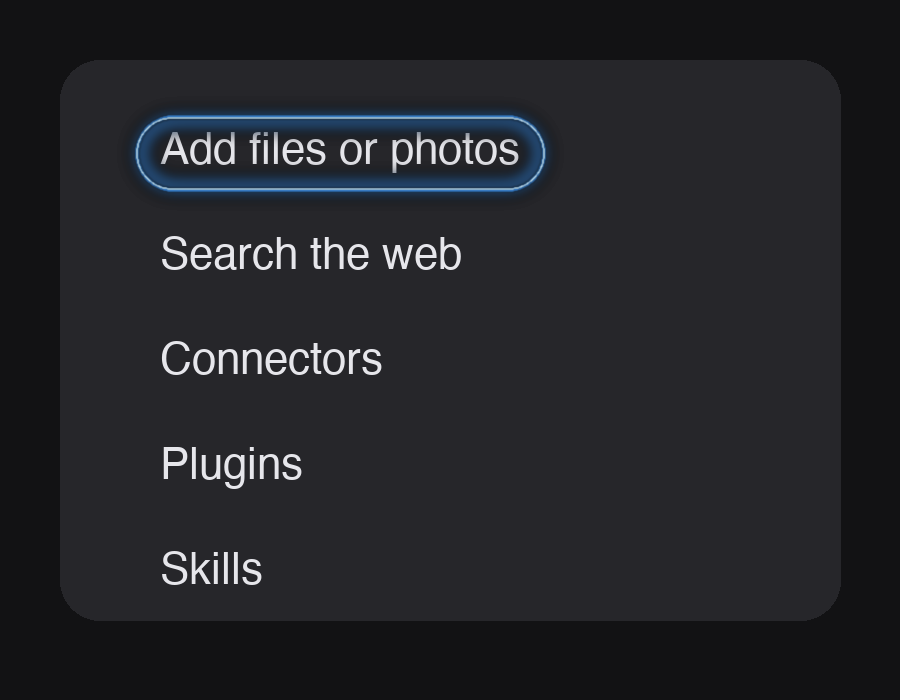
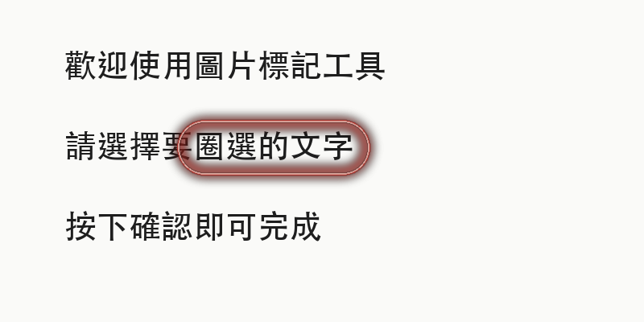

# image-text-highlighter

在圖片中找到指定文字，並加上漂亮的發光圈選效果（iOS 風格 glow highlight）。

使用 macOS 內建 Vision framework 做 OCR（支援中英文），再用 Pillow 畫出帶光暈的圓角圈選框。

## 效果展示

| 英文（預設藍色） | 中文（自訂紅色） |
| --- | --- |
|  |  |

## 需求

- macOS（使用系統內建的 Vision framework 做 OCR）
- Python 3.9+

```bash
pip3 install Pillow pyobjc-framework-Vision
```

## 用法

```bash
python3 circle_text.py 圖片.png "要標記的文字"
```

### 選項

| 選項 | 說明 |
| --- | --- |
| `-o 輸出.png` | 指定輸出路徑（預設為 `原檔名_marked.png`） |
| `--color "#FF3B30"` | 圈選顏色，hex 格式（預設 iOS 藍 `#409CFF`） |
| `--all` | 圈選文字出現的所有位置（預設只圈第一個） |

### 範例

```bash
# 基本用法
python3 circle_text.py screenshot.png "Add files or photos"

# 紅色圈選 + 指定輸出檔名
python3 circle_text.py test_zh.png "圈選文字" --color "#FF3B30" -o result.png

# 圈選所有出現的位置
python3 circle_text.py doc.png "重點" --all
```

## 特色

- **精準子字串定位**：即使目標文字只是某一行的一部分，也會取得精確的邊界框
- **模糊比對**：自動忽略大小寫、空白、全形半形差異
- **自動縮放**：線寬、光暈大小、留白依圖片尺寸調整，大截圖和小圖都適用
- **友善錯誤提示**：找不到文字時，會列出圖片中實際偵測到的所有文字，方便調整關鍵字
